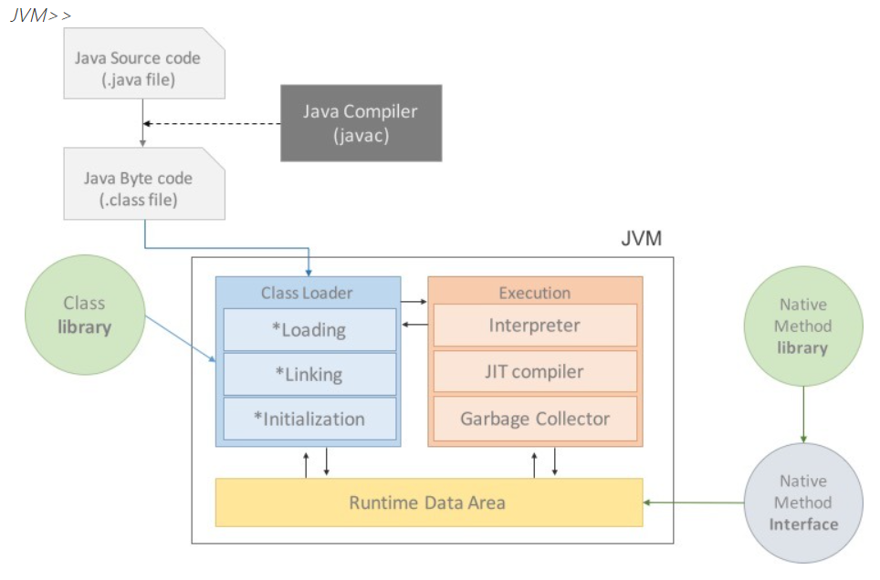
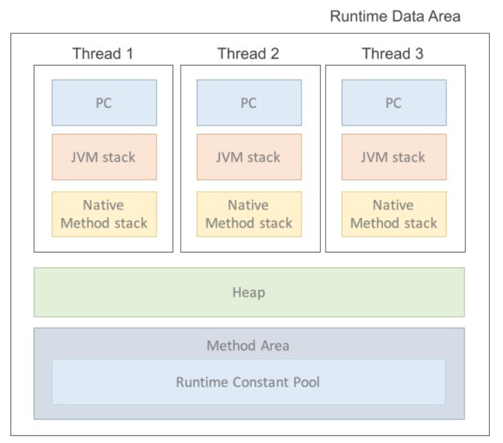

# 면접 대비 - Java편
> 기술 면접 대비 간단 개념 정리

목차
1. 객체지향
2. JVM
3. GC
4. Collection
5. Bean Scope
6. Singleton
7. Java version
8. IoC, DI, Contatiner
9. Entity, DTO, DAO

***

## 객체지향
로직을 상태와 행위로 이루어진 객체로 만드는 것  
상태와 행위를 가진 객체들을 레고 블럭처럼 조립해 하나의 프로그램으로 만드는 것  
ex: java, C++, C#, Ruby, ...

#### 장점
- 코드 재사용 용이: 기존 클래스의 재사용, 상속을 통한 확장
- 유지보수가 쉬움
- 대형 프로젝트에 적합

#### 단점
- 처리 속도가 절차지향에 비해 상대적으로 느림
- 객체가 많으면 용량이 커질 수 있음
- 설계 시 많은 시간&노력 필요

#### 특징 4가지
- `추상화`: 공통의 속성이나 기능을 묶어 이름을 붙이는 것
- `캡슐화`: 데이터 구조와 데이터를 다루는 방법들을 결합시킨 것
- `상속`: 상위 개념의 특징을 하위 개념이 물려받는 것
- `다형성`: 하나의 변수명, 함수명 등이 상황에 따라 다른 의미로 해석될 수 있는 것

#### SOLID
- `단일 책임`: 한 클래스는 하나의 책임
- `개방 폐쇄`: sw 요소는 확장에 열려 있고 변경에 닫혀 있음 (인터페이스를 구현해 새로운 클래스를 하나 만들어 새 기능 추가)
- `리스코프 치환`: 객체는 정확성을 깨뜨리지 않으며 하위 타입의 인스턴스로 변경 가능
- `인터페이스 분리`: 특정 클라이언트를 위한 여러 인터페이스보다 범용 인터페이스 하나보다 낫다
- `의존관계 역전`: 구현에 의존 x, 추상화에 의존 o. 클라이언트는 인터페이스를 보게 해 역할에 의존하게 해라.

## JVM; Java Virtual Machine
> 자바 바이트코드는 JRE 위에서 동작한다.  
> JRE에서 가장 중요한 요소는 자바 바이트코드를 해석하고 실행하는 JVM이다.

- 자바 바이트 코드를 해석하고 실행  
  (자바 바이트 코드: 사용자 언어(Java)와 기계어 사이의 중간 언어)
- 프로그램을 실행하기 위해 물리적 머신과 유사한 머신을 소프트웨어로 구현한 것
- JVM을 동작시키면 자바 실행 코드를 변경하지 않고 모든 종류의 HW에서 동작

#### 특징
- 스택 기반
- `심볼릭 레퍼런스`: 기본 자료형을 제외한 모든 타입을 메모리 주소 기반이 아닌 심볼릭 레퍼런스 기반
- `가비지 컬렉션`: 클래스 인스턴스는 사용자 코드에 의해 명시적으로 생성, GC에 의해 자동으로 파괴
- `기본 자료형을 명확히 정의해 플랫폼 독립성 보장`: 플랫폼에 따라 int형 크기가 달라지난 C와 달리 기본 자료형을 명확히 정의해 호환성 유지, 플랫폼의 독립성 보장
- `네트워크 바이트 오더`: 플랫폼 독립성을 유지하기 위해 고정된 바이트 오더를 유지해야 하므로 사용

#### JVM 구조
  

**Class Loader**
- JVM 내로 클래스 로드
- 링크를 통해 런타임 데이터 영역에 배치
- Runtime 시 동적으로 클래스 로드
- jar파일 내 저장된 클래스들을 JVM 위에 탑재하고 사용하지 않는 클래스들은 메모리에서 삭제

**Execution Engine**
- 클래스 실행시키는 역할
- 클래스 로더가 배치시킨 바이트 코드를 실제로 JVM 내부에서 기계가 실행할 수 있는 형태로 변경

**Runtime Data Area**  

- 프로그램 수행을 위해 OS에서 할당받은 메모리 공간
- `PC Register`: 스레드 시작 시 생성. 스레드가 어떤 부분을 어떤 명령으로 실행할지에 대한 기록. 현재 수행중인 JVM 명령의 주소 가짐
- `JVM stack`: 프로그램 실행 중 임시로 할당되었다가 메소드 빠져나가면 소멸되는 특성의 데이터
- `Native Method Stack`: 일반적인 메소드를 실행하는 경우 JVM 스택에 쌓이다가 해당 메소드 내부에 네이티브 방식을 사용하는 메소드가 있다면 해당 메소드는 네이티브 스택에 쌓임
- `Method Area`(`Static Area`, `Class Area`): 클래스 정보 처음 메모리 공간에 올릴 때 초기화되는 대상을 저장하기 위한 메모리 공간
- `Heap`: new 연산자로 생성된 객체와 배열 저장.

> 자바 프로그램의 실행 과정
> 1. JVM이 OS로부터 프로그램이 필요로 하는 메모리 할당
> 2. 컴파일러가 소스코드를 읽어 바이트 코드로 변환
> 3. Class Loader를 통해 class 파일들을 JVM으로 로딩
> 4. Execution Engine을 통해 로딩된 class파일들 해석
> 5. 해석된 바이트코드들 Runtime Data Areas에 배치되어 실질적 수행
> 이러한 실행 과정 속에서 JVM이 필요에 따라 Thread Synchronization이랑 GC 관리작업 수행

#### 주로 사용되는 옵션
> [10 important JVM options](https://geekflare.com/important-jvm-options/)

## GC; Garbage Collection
자바에서는 개발자가 프로그램 코드로 메모리를 명시적으로 해제하지 않는다.  
`가비지 컬렉터`를 통해 직접 필요 없는 객체(쓰레기)를 찾아 지우는 작업을 한다.  

#### GC의 전제 조건
1. 대부분의 객체는 금방 접근 불가능 상태가 된다.
2. Old 객체에서 Young 객체로의 참조는 아주 적게 존재한다.

위 조건에 따라 `HotSpot VM`에서는 크게 2개로 물리적 공간을 나눴다.
- `Young 영역`: 새롭게 생성한 객체의 대부분이 여기 위치. 대부분 금방 접근 불가능 상태가 되기 때문에 많은 객체가 Young 영역에서 생성 후 소멸. 이 영역에서 객체가 사라질 때 Minor GC 발생한다고 말함.
- `Old 영역`: Young 영역에서 살아남은 객체가 여기로 복사. 이 영역에서 객체가 사라질 때 Major GC라고 함.

> **카드 테이블**  
> Old 영역의 객체가 Young 영역 객체를 참조할 때를 대비해 정보를 표시  
> Young 영역 GC 실행 시 Old 영역의 모든 객체를 참조를 확인하지 않고 카드 테이블을 뒤진다.  

#### stop-the-world
: GC를 실행하기 위해 JVM이 애플리케이션 실행을 멈추는 것  
`stop-the-world` 발생 시 GC를 실행하는 스레드를 제외한 나머지 스레드는 모두 중단.  
GC 작업을 완료한 이후에 중단했던 작업을 다시 시작한다.  
> 어떤 GC 알고리즘을 선택해도 `stop-the-world`는 발생한다.  
> 대개 GC 튜닝이란 이 `stop-the-world` 시간을 줄이는 것이다.

## Collection
`List`, `Map`, `Set`과 같은 인터페이스 입니다.  
이를 구현한 구현체를 Collections라고 합니다.

java Collections의 사용을 권장하는 이유는 크게 두 가지가 있습니다.

1. 데이터를 조작할 때 다양한 api를 사용 가능  
> 예를 들어 String 배열에서 이름을 찾아야하는 로직을 찾아야할 때 for문이나 stream으로 변환하는 작업을 거쳐서 하나하나 확인하는 식으로 로직을 작성해야 합니다.      
> 하지만 String 배열을 List형태로 바꾼다면?  
> contains() 메소드를 사용함으로써 로직을 간단 명료하게 줄일 수 있습니다.

2. 공간적인 효율성`
> 배열이라면 미리 객체를 보관할 공간을 정해두어야 합니다.  
> 하지만 Collection을 이용한다면 상황에 따라 객체 수를 동적으로 지정할 수 있어 효율성이 좋습니다.

## Bean Scope
먼저 Spring Bean이란, 애플리케이션의 핵심을 이루는 객체로 IoC 컨테이너에 의해 인스턴스화, 관리, 생성됩니다.  
Bean Scope란 이름 그대로 Bean이 존재할 수 있는 범위를 의미합니다.  

기본적으로 Spring은 모든 Bean을 singleton으로 생성해 관리합니다.  
scope는 singleton 외에도 prototype, request, session 등을 지원합니다.

> - `singleton`: 스프링 디폴트 bean scope
> - `prototype`: 애플리케이션 요청시 스프링이 새 인스턴스를 생성
> - `request`: HTTP 요청별로 인스턴스화. 요청 종료 시 소멸
> - `session`: HTTP 세션별로 인스턴스화. 세션 종료 시 소멸
> - `global session`: 단일 빈 정의의 범위를 전역 HTTP 세션의 life cycle로 지정. 포틀릿 기반의 웹 애플리케이션 용도
> - `application`: 단일 빈 정의의 범위를 ServletContext의 life cycle로 지정. 웹 인식 Spring ApplicationContext의 컨텍스트에서만 유효
> - `custom`: Scope를 직접 구현하고 커스텀 스코프를 스프링의 설정에 등록하여 사용

## Java version
- jdk 1.0
- jdk 1.1 
  - Java Beans
  - Inner Class
  - Reflection
  - RMI
  - 유니코드 지원
- jdk 1.2
  - Swing이 SE에 포함
  - Coarba IDL: 이종기기간 함수 호출 스펙
  - Collection Framework
- jdk 1.3
  - HotSpot: Sun에서 만든 JIT 구현
  - JNDI: 디렉토리 및 이름으로 원하는 서비스 찾기
- jdk 1.4
  - 정규표현식
  - assert
  - Non-Blocking IO
  - XML API
  - Java Web Start
- jdk 1.5
  - Generics
  - Annotation
  - Auto Boxing/Unboxing
  - Enumeration
  - 가변 길이 파라미터
  - static import
  - java.util.Scanner
- java 6
  - GC 지원
- java 7
  - Diamond Operator <>
  - switch문에서 String 사용
  - Dynamic Language 지원
- java 8
  - Lambda
  - Oracle JDK, OpenJDK 2가지로 나뉨
  - new Date and Time API
  - Stream
  - Optional
- java 9
  - jigsaw 기반으로 런타임이 모듈화됨
- java 10
  - var 키워드
  - 병렬 처리 GC 도입 -> 성능 향상
  - 개별 스레드로 분리된 stop-the-world
  - java 기반 JIT 컴파일러 추가
- java 11
  - Oracle JDK, OpenJDK 통합
  - 유료화로 인해 서드파티 JDK로 이전 필요
- java 12
  - switch문 확장
- java 13
  - switch문 개선을 위한 yield 예약어 추가
- java 14
  - instanceof 패턴 매칭
  - record라는 데이터 오브젝트 선언 추가
- java 15
  - EdDSA 암호화 알고리즘 추가
  - 스케일링 가능한 낮은 지연의 가비지 컬렉터 추가
  - 외부 메모리 접근 API
  - 상속 가능한 클래스를 지정할 수 있는 봉인 클래스 제공
- java 16
  - Vector API
  - 유닉스 도메인 소켓 지원
  - jpackage 명령어: OS별 자바 프로그램 설치 패키지로 생성하는 기능
- java 17
  - 의사난수 생성기를 통한 예측이 어려운 난수 생성 API
  - 봉인 클래스 정식 추가
  - 컨텍스트 기반의 역직렬화 필터링

## IOC & DI & Container
> [https://yeonyeon.tistory.com/2](https://yeonyeon.tistory.com/2)

## Entity vs DTO vs DAO
> [https://yeonyeon.tistory.com/163](https://yeonyeon.tistory.com/163)

***
참고
1. [Interview Question for Beginner](https://github.com/JaeYeopHan/Interview_Question_for_Beginner/tree/master/Java)
2. [spring - Bean Scope](https://docs.spring.io/spring-framework/docs/4.2.5.RELEASE/spring-framework-reference/html/beans.html#beans-factory-scopes)
3. [Naver D2 - JVM](https://d2.naver.com/helloworld/1230)
4. [Jbee님 블로그 - JVM](https://asfirstalways.tistory.com/158)
5. [Naver D2 - GC](https://d2.naver.com/helloworld/1329)
6. [jacob0122님 블로그 - 객체 지향 프로그래밍이란?](https://velog.io/@jacob0122/%EA%B0%9D%EC%B2%B4-%EC%A7%80%ED%96%A5-%ED%94%84%EB%A1%9C%EA%B7%B8%EB%9E%98%EB%B0%8D%EC%9D%B4%EB%9E%80)
7. [en.wikipedia.org - java version](https://en.wikipedia.org/wiki/Java_version_history)
