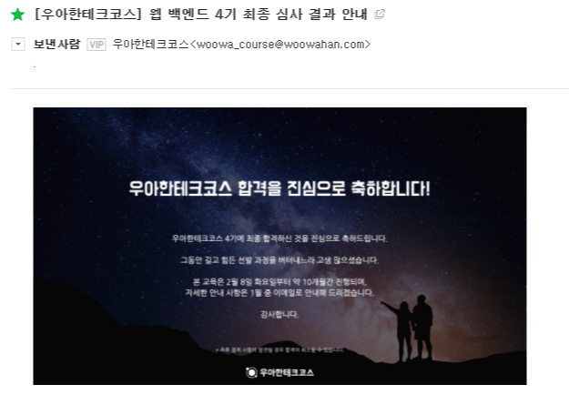

> 전체 후기: https://yeonyeon.tistory.com/176

## 서류 접수

> 10/22~11/03

우테코에 백엔드 파트로 지원하게 되었다. 예전부터 해보고 싶었다는 생각은 했는데 때마침 시기 적절하게도 내가 백수일 때 4기 모집을 열길래 지원하였다.

설명회를 보기 전에는 남들보다 뛰어나보이기 위해 아는 기술 다 끌어모아서 작성해야하나 싶었는데 설명회를 듣고나서 생각이 바뀌었다. (설명회에서 ✨힌트✨ 많이 던져주시니까 지원 전에 꼭 들어보세요!!) 내가 이런
기술을 써봤어요~ 라고 보이기보다는 내가 무슨 활동을 해봤는지, 그로 인해 깨달은 점이나 고민하는 점이 무엇인지. 나는 왜 여기 참여하고 싶은지 등에 대해 솔직하게 털어놓았다. 서류를 쓰면서 생각한건... 경력이
중요한게 아니다. (경력만 어필하면 오히려 마이너스 사항이라 생각함) 자신이 어떤 마음 가짐으로 참여할 것인가가 중요한 것 같다.

남이 쓴 예제를 보고 쓰면 비슷한 글이 될 수 있으므로... 구체적으로 어떻게 답변 했는지는 생략한다.

나도 많은 후기 글을 보면서 답변을 어떻게 적었는지에 대한 포스팅들은 다 생략했다.

## 온라인 코테

> 11/6 14:00

총 7문제가 주어진다. 나는 프로그래머스 1~2단계를 대부분 풀어본 정도? 백준도 실버 2등급으로 막 복잡한 수준의 코테는 풀지 못하는 편이다. 한 문제 빼고는 다 풀었으니 문제 난이도는 쉬운 편이라고 생각한다.

(여기서 풀었다는건 문제를 완벽히 풀이했다는건 아니고.. 주어진 테스트 케이스는 통과했다는 의미임)

## 프리코스

> 11/24 ~ 12/14

백엔드는 Java, 프론트엔드는 Javascript로 진행된다. (언어 변경 불가)

1주에 1번 총 3개의 과제를 제출해야하는데, 모든 과제를 제출해야 최종 코딩 테스트에 참가할 자격이 주어진다.

이미 온라인에도 공개되어 있는 문제고 사람들이 많은 후기를 올려서 푸는데 막 어렵지는 않다.

프리코스 후기는 별도로 남겨두었으니 링크로 대체한다.

- 1주차 후기: https://yeonyeon.tistory.com/165
- 2주차 후기: https://yeonyeon.tistory.com/170
- 3주차 후기: https://yeonyeon.tistory.com/172

## 최종 코테

> 12/18 13:00

약 5시간 동안 코테를 진행하였다.

많이 긴장 됐는데 여태껏 진행한 과제와 크게 다르지 않았다.

제한 시간이 주어진 점을 제외하면 오히려 3주차 자판기 과제가 더 어렵지 않았나 싶다.

5시간 코테 전에 신분증 검사를 하고 곧바로 코딩을 시작했다.

프리코스를 진행하며 가장 크게 바뀐 점은 '일단 돌아가게 개발하고 리팩토링을 통해 점점 더 발전시키자'라는 마음가짐을 갖게 되었는데 요 마음가짐 덕에 무사히 종료하지 않았나 싶다.

코테를 볼 때는 별로 떨리지 않았다.

다만 최종 발표까지 기다리며 심장이 미친듯이 두근거리는건... 어쩔 수 없었다 ㅋㅋㅋ ㅠㅠㅠㅠ

우테코 까짓거 어! 떨어져도 다른데 지원해서 열심히 개발하면 된다! 라는 생각으로 신청했지만 프리코스를 진행하며 우테코와 함께 하고싶은 열망이 커져갔기 때문에... 👉👈

## 최종 발표 (12/30 15:00)

  
최종 합격!
감사하게도 최종 합격에 선발되었다ㅠㅠㅠㅠㅠㅠㅠㅠㅠㅠㅠ😢😢😢😂😂😭😭😭😂😢

2월부터 지내게 될 4기 사람들이 궁금하고 수료 후 얼마나 성장할 수 있을지 우테코 커리큘럼과 나에 대한 기대가 만발하다.

1월에는 우테코 3기 회원 분이 주관하시는 스터디를 신청해두었다.

해당 스터디 진행 + 토이 프로젝트를 1차 프로토타입까지 마치면 우테코 4기를 기분 좋게 맞이할 수 있겠지 ㅎ.ㅎ