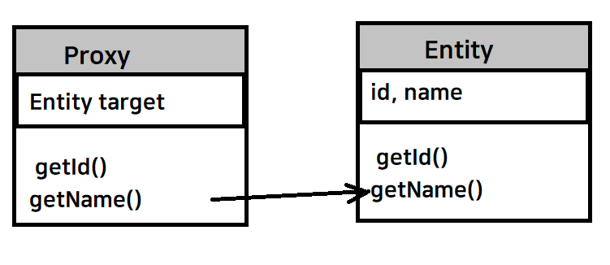

> inflearn / 김영한 / 자바 ORM 표준 JPA 프로그래밍 - 기본편  
> '연관관계 매핑 기초', '다양한 연관관계 매핑' 편  
> 실습 예제 Git: https://github.com/yeon-06/inflearnSpring/tree/master/jpa-ex1 의 cascade 폴더

### Proxy
- Entity Manager의 `.getReference()`를 통해 DB 조회를 미루는 가짜(프록시) 엔티티 객체 조회
- 실제 클래스를 상속 받아 생성 (겉 모양이 같다)
- 사용 입장에서는 진짜 객체인지 프록시 객체인지 구분 안해도 됨
- 실제 객체의 참조(`target`)을 보관
- 프록시 객체에서 메소드 호출하는 경우, 프록시 객체가 실제 객체의 메소드 호출


#### proxy 동작 과정 예제
```java
Member member = em.getReference(Member.class, “id1”);
member.getName();
```
1. `getReference()`를 통해 프록시 객체 생성
2. 사용자가 프록시 객체의 `getName()` 호출
3. 프록시 객체가 영속성 컨텍스트에 초기화 요청
4. 영속성 컨텍스트가 DB를 조회해 실제 Entity 생성
5. 프록시 객체의 Member target에서 `getName()` 호출
6. `getName()` 결과 반환

#### 프록시와 초기화
- 프록시 객체는 처음 사용할 때 한 번만 초기화
- 초기화 시, 프록시 객체가 실제 Entity 객체로 대체되는 것이 아님    
  프록시 객체를 통해 실제 Entity에 접근 가능하게 되는 것.

#### 프록시와 타입 체크
- 프록시 객체는 원본 엔티티를 상속받아 사용  
  -> == 비교 시 실패. `instanceof` 사용해야 함.
- 영속성 컨텍스트에 찾는 엔티티가 이미 존재하면 `getReference()`를 호출해도 실제 Entity 객체 반환
- `getReference()` 후에 `find()`로 찾은 객체는 Entity 객체가 아니라 Proxy 객체
> 위 사항은 JPA가 같은 트랜잭션에서 같은 객체를 가져온 경우 == 연산의 결과가 항상 true로 나오기 위함이다.

#### 프록시와 준영속 상태
 위에서 프록시 동작 과정을 살펴보면 초기화 할 때 영속성 컨텍스트에 요청을 한다.  
그렇다면 영속성 컨텍스트에 분리된 상태인 준영속 상태에서는 어떻게 동작할까?  
-> `org.hibernate.LazyInitializationException` 예외가 발생

#### 프록시와 지연 로딩
`Member` 안에 `Team`이라는 객체가 존재한다고 가정하자.  
`Member`에 대한 정보만 필요할 때까지 `Team`의 정보가 전부 조회되는건 불필요하게 느껴진다.  
이를 방지하기 위해 지연 로딩 `LAZY`를 사용해서 `Team`을 프록시로 조회할 수 있다.  

```java
@Entity
public class Member {
    @Id
    @GeneratedValue
    private Long id;
    
    @Column(name = "USERNAME")
    private String name;
    
    @ManyToOne(fetch = FetchType.LAZY)
    @JoinColumn(name = "TEAM_ID")
    private Team team;
    
    // getter, setter ... 
}
```

지연 로딩의 반대인 즉시 로딩은 EAGER 키워드를 사용하면 된다.
- `@ManyToOne`, `@OneToOne`의 디폴트: 즉시 로딩
- `@OneToMany`, `@ManyToMany`의 디폴트: 지연 로딩

> 실무에서는 가급적이면 지연 로딩만 사용하는 것이 좋다.  
> 즉시 로딩을 적용하면 예상치 못한 SQL이 발생할 수 있다.
> JPQL의 경우 N+1 문제를 일으킬 수 있다.  
> (N+1 문제: 쿼리문 실행 후 Member를 가져온다. Team이 즉시로딩으로 세팅되어 있으면 Team의 select 쿼리문을 하나 더 실행시킨다.)
> 
> (+) 지연 로딩으로 설정 후 Team의 정보를 가져오려면 patch join이나 Entity Graph 기능을 사용.

### 영속성 전이
- CASCADE
- 특정 Entity를 영속화 하는 경우, 연관 Entity까지 함께 영속화
- 연관 관계랑은 관련이 없음

```java
@OneToMany(mappedBy = "test", cascade = CascadeType.PERSIST)
```

#### CASCADE의 종류
- `ALL`: 모두 적용
- `PERSIST`: 영속
- `REMOVE`: 삭제
- `MERGE`: 병합
- `REFRESH`: refresh
- `DETACH`: detach

### 고아 객체
- 부모 엔티티와 연관 관계가 끊어진 자식 엔티티
- `orphanRemoval = true`로 하면 자동으로 고아 객체가 삭제 됨
- `@OneToMany`, `@OneToOne`에서만 가능
- `CascadeType.REMOVE`처럼 작동

### 영속성 전이와 고아 객체
이 둘은 로직 작성 시 어떤 Entity까지 영향이 가느냐를 고려하게 되므로 신중히 사용해야 함.  
보통 소유자가 단 하나일 때나 DDD의 Aggregate Root에서 사용.