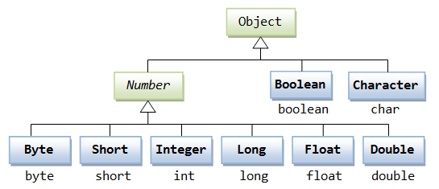

### Array와 ArrayList 차이

|  | Array | ArrayList |
| --- | --- | --- |
| 크기 | 고정 | 가변 |
| 값 | Primitive type, Object | Object |
| 제네릭 | 사용 불가능 | 사용 가능 |
| 다차원 | 가능 | 불가능 |

❓ **ArrayList**는 어떻게 **크기가 가변**되는가?

👉 내부적으로 별도의 크기 지정이 없으면 10개의 공간으로 배열 생성. size를 나타내는 capacity 변수를 통해 ArrayList에 요소가 더해지면 capacity를 늘림. 설정한 capacity를 넘어서 더 많은 객체가 들어오면 배열 크기를 1.5배 증가시킴.

❓ **Wrapper Class**

👉 int 같은 원시 타입을 담을 수 있는 객체

ex: Integer, Boolean, ...

- Boxing: 기본형 → 래퍼 클래스 변환
- Unboxing: 래퍼 클래스 → 기본형 변환