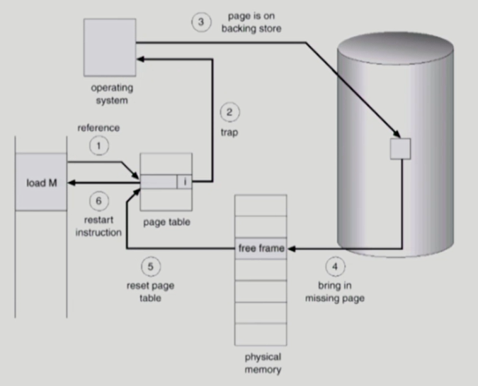

## 가상 메모리
- 물리적 메모리를 고려할 필요 없이 가정한 자기 자신만의 메모리 주소 공간
- 메모리 적재 단위에 따라 `요구 페이징`, `요구 세그먼테이션 방식`으로 구현
    - `요구 세그먼테이션 방식`: 하나의 세그먼트를 여러 개의 페이지로 나누어 관리하는 페이지드 세그먼테이션 기법 사용할 때 이용

### 요구 페이징; Demand Paging
- CPU의 요청이 들어온 후에야 해당 페이지를 메모리에 적재
- 메모리 사용량 ↓
- 프로세스 전체를 메모리에 올리느라 소요되는 입출력 오버헤드 ↓
- 더 많은 프로세스 수용
- `Valid-Invalid Bit`; `유효-무효 비트`
    - 각 페이지가 메모리에 존재하는지 표시
    - 페이지 테이블의 각 항목별로 저장 (invalid로 초기화)
    - `Invalid`: 사용되지 않는 주소 영역 or 페이지가 물리적 메모리에 없음
    - 무효로 세팅되어 있으면 `page fault`라고 불림
- 페이지 부재 ↓ -> 성능 ↑

#### 페이지 부재; page fault

1. CPU가 무효 페이지 접근 시 `MMU`가 페이지 부재 트랩 발생
2. CPU의 제어권 `커널 모드`로 전환
3. `페이지 부재 처리루틴` 호출
    - 유효한 접근인지 체크
    - 물리적 메모리에서 빈 프레임을 할당받기 (없으면 뺏어옴 -> Page Replacement)
    - 해당 페이지를 디스크에서 메모리로 읽기
      - 디스크 I/O 종료 전까지 프로세스는 PCU를 선점당함 (block)
      - 디스크 읽기가 끝나면 page tables entry 기록, valid-invalid bit = `valid`
      - ready queue에 프로세스 삽입
    - 이 프로세스가 CPU를 잡고 다시 running
    - 중단되었던 명령 마저 실행

### Page Replacement; 페이지 교체
- 빈 프레임이 존재하지 않을 경우 어떤 프레임을 뺏을지 결정해야 함  
  (= 메모리에 올라온 페이지 중 하나를 `swap-out`해 메모리 빈 공간 확보)
- 곧바로 사용되지 않을 페이지를 쫓아내는 것이 좋음
- 동일 페이지가 여러 번 메모리에서 쫓겨났다 돌아올 수 있음
- `Page Replacement`의 알고리즘은 `page-fault rate`의 최소화가 목적

#### Optimal Algorithm
- = `MIN Algorithm`; `OPT Algorithm`; `Belady's Optimal Algorithm`
- `MIN` (OPT): 가장 먼 미래에 참조되는 페이지를 replace
- 미래의 참조를 알고 있다는 가정 하에 만들어진 알고리즘으로 실제 사용하기는 어려움  
  -> 다만 다른 알고리즘의 성능에 대한 Upper Bound 제공

#### FIFO Algorithm
- First In First Out
- `FIFO Anomaly` 발생: 프레임 ↑ -> page fault ↑

#### LRU Algorithm
- Least Recently Used
- 가장 오래 전에 참조된 것을 삭제
- O(1) 가장 최근 참조만 알면 됨

#### LFU Algorithm
- Least Frequently Used
- 참조 횟수가 가장 적은 페이지 삭제
- 최저 참조 횟수가 여럿인 경우
  - 여러 페이지 중 임의 로 선정
  - 성능 향상을 위해 가장 오래 전에 참조된 페이지 삭제 가능
- 참조 시점의 최근성 반영 못함  
  (미래에 여러번 호출될 예정인데 현재까지의 참조만 판단해서 삭제될 수 있음)
- O(n) 참조 횟수 비교 필요 (`heap` 이용해 구현하면 O(logN))
- 페이지 참조 횟수를 계산하는 방식에 따라
  - Incache-LFU: 물리적 메모리 올라온 후의 참조 횟수만 카운트 (쫓겨났다 다시 들어오면 0)
  - Perfect-LFU: 과거 총 참조 횟수

> **LRU, LFU 알고리즘은 실제 사용은 불가능**하다.  
> 👉 페이지 폴트가 일어나는 페이지는 `List` 형태의 줄의 가장 아래에 위치시키면 된다.  
> 이미 메모리에 존재하는 페이지들은 사용자 프로그램에서 바로 사용하면 된다.  
> 즉, OS의 개입이 없다. 그러므로 줄 위치를 변경하는 것이 불가능

#### Clock Algorithm
- = `NUR`; `Not Used Recently` = `NRU`; `Not Recently Used` = `Second chance Algorithm`
- `LRU`와 비슷한 알고리즘
- `reference bit`
  - 페이지가 참조되면 하드웨어에 의해 1로 세팅
  - 알고리즘을 통해 하나씩 이동하며 1 -> 0 변경
  - 알고리즘이 0 찾으면 해당 페이지 교체
  - 자주 사용되는 페이지라면 second chance에서 1일 것  
    (second chance: 한바퀴 다 돈 후 두번째로 접근)
- `modified bit`; `dirty bit`
  - 1: 최근에 변경된 페이지 (I/O 동반 페이지)
  - 페이지 교체 당할 때 변경 사항을 메모리에 반영하고 교체 당함

> **캐슁 기법**
> - 한정된 빠른 공간(cache)에 요청된 데이터를 저장해두었다 후속 요청 시 cache가 직접 서비스
> - 페이징 기법 뿐 아니라 cache memory, buffer caching, web caching 등 여러 곳에서 사용
> - 교체 알고리즘에서 삭제할 항목을 결정하는 일에 지나치게 많은 시간이 걸리면 실제 시스템에서 사용 X
> - `Buffer caching`, `Web caching`의 경우
>     - O(1) ~ O(logN)
> - `Paging System`의 경우
>     - `page fault`인 경우에만 OS가 관여
>     - 페이지가 이미 메모리에 존재하는 경우 참조 시각 등의 정보를 OS가 알 수 없음
>     - O(1) LRU의 list 조작조차 불가능

### Allocation Problem
- 각 프로세스에 얼만큼의 page frame을 할당할 것인가?
- 명령어 수행을 위해 할당되어야 하는 최소한의 프레임 수 존재
- 루프 형태의 페이지(`Clock Algorithm`같은)들은 한꺼번에 allocate 되는 것이 유리
  - 최소한의 allocation 없으면 매 루프마다 `page fault` 발생
- 할당 알고리즘
  - `Equal allocation`: 모든 프로세스에 똑같이 할당
  - `Proportional allocation`: 프로세스 크기에 비례해 할당
  - `Priority allocation`: 프로세스 priority에 따라 할당

### Global Replacement vs Local Replacement
#### Global Replacement; 전역 교체
- 할당 X
- 교체 시 다른 프로세스에 할당된 프레임 뺏어올 수 있음
- 프로세스 별 할당량 조절하는 방법 중 하나
- 무한 경쟁 (서로 뺏을 수 있으므로)
- `LRU`, `LFU`, `클럭` 등의 알고리즘을 물리적 메모리 내 전체 페이지 프레임들을 대상으로 적용하는 경우

#### Local Replacement; 지역 교체
- 일단 할당 후 할당된 frame 내에서 replacement
- `FIFO`, `LRU`, `LFU` 알고리즘을 프로세스 별로 운영 시

### 스레싱; Thrashing
- 프로세스 수행에 필요한 최소 `page frame` 수를 할당 받지 못하는 경우 발생
- 이를 방지하기 위해 `Working Set`, `PFF` 알고리즘이 있음

1. 페이지 부재율 ↑
2. CPU 이용률 ↓
3. OS는 프로세스 수가 너무 적다 생각해 MPD ↑
4. 각 프로세스에 할당되는 메모리 양 ↓
5. 최소한의 페이지 프레임도 할당받지 못해 페이지 부재 발생 (반복)

> MPD; Multi Programming Degree; 다중 프로그래밍 정도  
> : 메모리에 동시에 올라가 있는 프로세스 수

#### Working-Set Model
Locality of reference
- 프로세스는 특정 시간 동안 일정 장소만을 집중적으로 참조함
- `Locality Set`: 집중적으로 참조되는 page들의 집합  

Working-Set Model
- 프로세스의 working set 전체가 메모리에 올라와있어야 수행됨
- 일부만 메모리에 올라온 경우 모든 frame 반납 후 swap out
- Working Set을 결정하기 위해  Working Set Window 사용
- 과거에 n 시간 동안 사용한 페이지들을 메모리에 할당
  - 메모리가 부족해서 Δ시간 동안 사용한 페이지들의 일부만 할당 가능한 상황이라면? -> 할당 받지 X  
    (= working set을 보장하는 경우에만 할당이 됨)

> Working Set (=Locality Set)  
> : Locality에 기반해 프로세스가 일정 시간 동안 월활히 수행되기 위해 한꺼번에 메모리에 올라와 있어야 하는 페이지들의 집합

#### PFF Algorithm
- Page Fault Frequency Scheme
- 페이지 부재율을 주기적으로 조사해 메모리 양 조절
- `page fault rate` > `상한값`: frame 추가 할당
- `page fault rate` < `하한값`: frame 할당 ↓
- 빈 frame 없으면 일부 프로세스 swap out

### page size에 대해
- page size ↓
  - 페이지 수 ↑
  - 페이지 테이블 크기 ↑
  - Internal fragmentation ↓
  - Disk Transfer 효율성 ↓
    - 대개 메모리는 인접한 위치가 연달할 확률이 큰편
    - 같은 페이지에 존재할 경우 용이하게 사용 가능했을 것
  - 필요한 정보만 메모리에 올라와 메모리 이용 효율 ↑
    - Locality의 활용 측면에서는 not good
- 트렌드: 요즘은 메모리 크기가 점점 더 커져서 page size도 ↑