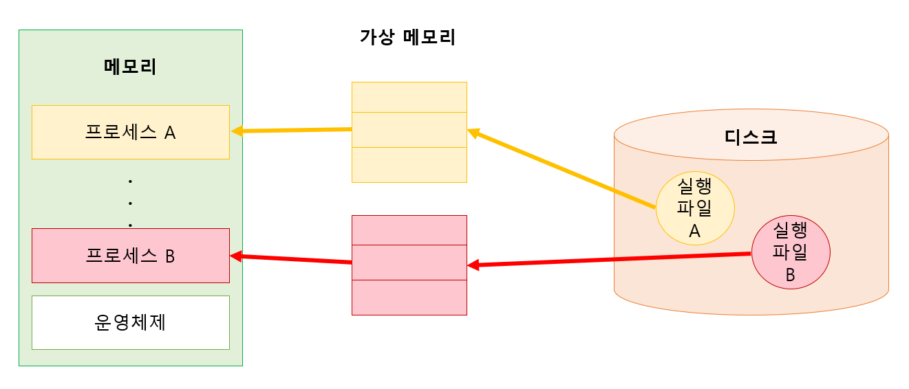

### 논리적 주소, 물리적 주소
#### 논리적 주소
- 프로세스마다 독립적으로 가지는 주소 공간
- 각 프로세스마다 0번지부터 시작
- CPU가 보는 주소

#### 물리적 주소
- 메모리에 실제 올라가는 위치

> **CPU가 보는 주소는 왜** 물리적이 아니라 **논리적 주소일까?**  
> 소스 코드를 컴파일하면 실행 파일이 생성된다.  
> 해당 파일을 실행시키면 메모리 위치는 변경되지만 코드 내에 존재하는 주소는 변경되지 않는다.  
> (이를 변경하려면 재컴파일 필요)  
> CPU는 기계어를 수행하기 때문에 코드 내 존재하는 주소를 이용하게 되므로 실행 시 물리적 주소로 변환이 필요하다.

### 주소 바인딩
`Symbolic Address` -> `Logical Address` -> `Physical Address`
- `Symbolic Address` -> `Logical Address`
  - 소스코드가 컴파일되어 실행파일 생성 시
- `Logical Address` -> `Physical Address`
  - 하드웨어가 수행
  - 크게 3가지 방법으로 나뉨  
    (아래 참고)

1. `Compile Time Binding`
   - 컴파일 시점에 해당 프로그램이 물리적 메모리의 위치 결정
   - 물리 메모리 위치 변경 시 재컴파일 필요
   - 컴파일러는 절대 코드를 생성
2. `Load Time Binding`
   - 프로그램 실행이 시작될 때 물리적 메모리 주소 결정
   - `Loader`의 책임하에 물리적 메모리 주소 부여  
     (`Loader`: 사용자 프로그램을 메모리에 적재시키는 프로그램)
   - 컴파일러가 재배치 가능 코드를 생성한 경우 가능
3. `Run Time Binding`; `Execution Time Binding`
   - 수행이 시작된 후에도 프로세스의 메모리 상 위치 이동 가능
   - CPU가 주소 참조할 때마다 바인딩 점검 (address mapping table)
   - `기준 레지스터`, `한계 레지스터`, `MMU`라는 하드웨어적 자원 필요
    
#### MMU; Memory Management Unit
- CPU가 특정 프로세스의 논리적 주소를 참조하려고 하면 `MMU`가 주소값에 `기준 레지스터 값`을 더해 물리적 주소 값을 얻어냄
- 사용자 프로그램, CPU는 논리적 주소를 다루고 물리적 주소는 모름
- Context Switching 발생 시 `재배치 레지스터 값`을 재설정 (프로세스가 바뀌었으므로)
  - 이 경우 프로세스의 주소 공간을 벗어날 수 있음
  - 메모리 보안 미준수로 인해 다른 사람이 수행 중인 프로그램 영역 침범, OS 존재하는 메모리 영역 변경 등
  - 이를 방지하기 위해 `한계 레지스터` 등장
- `한계 레지스터`: 프로세스가 자신의 주소 공간을 넘어서는 메모리 참조를 하려는지 체크  
  (수행 중인 프로세스의 논리적 주소 최댓값 즉, 프로세스 크기를 담음)

> Base Register = 기준 레지스터 = Relocation Register = 재배치 레지스터

### 동적 로딩; Dynamic Loading
- 프로세스 내에서 실행에 필요한 부분이 실제로 불릴 때 메모리에 적재
- 다중 프로그래밍에서 메모리 사용 효율성 ↑

### 동적 연결; Dynamic Linking
- Linking: `Object File` + `Library File`로 하나의 실행 파일을 생성하는 과정
  - `Object File`: 소스 코드를 컴파일해 생성
  - `Library File`: 이미 컴파일 완료된 파일
- 실행 파일에 라이브러리 코드가 포함 X
- 프로그램이 실행되며 라이브러리 함수 호출 시에 라이브러리와 연결
- 라이브러리 호출 부분에 `스텁` 포함
  - `Stub`: 라이브러리 위치를 찾기 위한 작은 코드
- 라이브러리가 이미 메모리에 있으면 해당 루틴의 주소로 접근, 없으면 디스크에서 읽어옴
- OS 도움 필요

### 중첩; Overlays
- 프로세스의 주소 공간을 분할해 실제 필요한 부분만 메모리에 적재
- 프로세스 크기 > 메모리 인 상황에서 유용
- 단일 프로세스만 메모리에 올려두는 경우 메모리 용량보다 큰 프로세스를 실행하기 위해 어쩔 수 없이 선택
- 프로그래머가 직접 구현(Manual Overlays) 가능하나 상당히 복잡

### 스와핑; Swapping
- 메모리에 올라온 프로세스의 주소 공간 전체를 스왑 영역에 일시적으로 내려놓는 것
- 메모리에 존재하는 프로세스 수 조절  
  (= 다중 프로그래밍의 정도 조절)

#### Backing Store; 백킹스토어
- = 스왑 영역
- 프로세스가 수행 중인 동안에만 디스크에 일시적으로 저장하는 공간
- != 파일 시스템
- 다수의 프로세스 이미지를 담을 수 있게 충분히 크고 빨라야 함

> 파일 시스템은 종료 상태에도 내용이 유지되어야 하는 비휘발성 저장 공간임

#### 스와핑 과정
- `Swap in`: 디스크 -> 메모리
- `Swap out`: 디스크 <- 메모리

1. Swapper에 의해 Swap Out 시킬 프로세스 선정  
   (Swapper = medium-term scheduler = 중기 스케줄러)
2. 1의 프로세스는 현재 메모리에 올라가 있는 주소 공간의 내용을 스왑 영역에 `Swap Out`
3. 메모리에 남은 프로그램들이 충분히 실행된 후에 해당 프로그램을 메모리에서 내쫓음
4. 2의 `Swap Out`되었던 프로그램을 `Swap in`

> **주소 바인딩과 스와핑**  
> `Compile Time Binding`, `Load Time Binding`: 원래 존재하던 메모리 위치로 Swap in  
> `Run Time Binding`: 빈 메모리 영역 아무데나 Swap in

#### 스와핑의 소요 시간
- 전송 시간; Transfer Time
  - 스와핑 소요 시간의 대부분 차지
  - 디스크 섹터에서 실제 데이터를 읽고 쓰는 시간
- 탐색 시간; Seek Time
  - 헤드를 해당 트랙으로 움직이는데 걸리는 시간
- 회전 지연 시간; Rotational Latency
  - 헤드가 원하는 섹터에 도달하기까지 시간

### 물리적 메모리의 할당
- 물리적 메모리는 크게 `OS 상주 영역`, `사용자 프로세스 영역`으로 나뉨
  - `OS 상주 영역`
    - 인터럽트 벡터와 함께 물리적 메모리의 낮은 주소 영역 사용
    - OS 커널 적재
  - `사용자 프로세스 영역`
    - 물리적 메모리의 높은 주소 영역 사용
    - 여러 사용자 프로세스들 적재

#### 사용자 프로세스 영역의 관리 방법
1. 연속 할당
   - 각각의 프로세스를 물리적 메모리의 연속적 공간에 올리는 방식
   - 물리적 메모리를 다수의 분할로 나누어 1분할 1프로세스 적재
   - `고정 분할 방식`: 물리적 메모리를 고정된 크기로 분할해 미리 나눔
   - `가변 분할 방식`: 프로그램 실행, 종료 순서에 따라 분할 관리
2. 불연속 할당
   - 하나의 프로세스를 물리적 메모리의 여러 영역에 분산해 적재
   - `페이징 기법`: 각 프로세스의 주소 공간을 동일한 크기의 페이지로 잘라 메모리에 페이지 단위로 적재
   - `세그먼테이션 기법`: 프로그램의 주소 공간을 세그먼트로 나눠 세그먼트 단위로 적재
   - `페이지드 세그먼테이션 기법`: 세그먼트 하나를 다수의 페이지로 구성

> 세그먼트: 코드, 데이터, 스택 등 의미 있는 단위

#### 고정 분할 방식
- 연속 할당 기법
- 메모리를 주어진 개수만큼의 영구적 분할로 미리 나눔
- 각 분할 크기는 모두 똑같이 해도 되고 다르게 해도 됨
- `외부 조각`, `내부 조각` 발생 가능
  - `외부 조각`: 프로그램 크기 > 분할 크기라 프로그램 적재 불가한 빈 분할
  - `내부 조각`: 프로그램 크기 < 분할 크기라 분할에 적재된 후에 분할 내부에서 사용되지 않는 메모리 조각

#### 가변 분할 방식
- 연속 할당 기법
- 프로그램의 크기를 고려해 메모리를 할당
- 외부 조각 발생 가능
  - 메모리에 존재하는 프로그램이 종료된 경우 발생하는 빈 공간 < 새롭게 시작되는 프로그램 크기
  - `compaction`
    - 가변 분할 방식에서 외부 조각 문제 해결을 위한 방법
    - 사용중인 메모리 영역을 한쪽으로 몰고 가용 공간들을 다른 쪽으로 모아서 하나의 큰 가용 공간 생성
    - 비용이 많이 듦
    - 실행 중 프로세스의 주소가 동적으로 바뀔 수 있는 환경에서만 사용 가능
- 가용 공간(`hole`)이 여러 곳에 산발적으로 존재
- 동적 메모리 할당 문제
  - 주소 공간의 크기가 n인 프로세스를 메모리에 올릴 때 물리적 메모리 내 가용 공간 중 어떤 위치에 올릴 것인지
  - `first fit`
    - 크기 n 이상인 가용 공간 중 제일 먼저 찾아지는 곳에 할당
    - 시간 측면에서 효율적
  - `best fit`
    - 크기 n 이상인 가장 작은 가용 공간 찾아 할당
    - 정렬되어 있지 않으면 모든 가용 공간 탐색 -> 시간적 오버헤드
  - `worst fit`
    - 가용 공간 중 가장 크기 큰 곳에 할당
    - 정렬되어 있지 않으면 모든 가용 공간 탐색 -> 시간적 오버헤드

#### 페이징 기법

- 불연속 할당 기법
- 프로세스의 주소 공간을 동일 크기의 페이지로 나눠 물리적 메모리의 서로 다른 위치에 페이지들 저장
- 프로세스의 주소 공간 일부는 `백킹스토어`에, 일부는 `물리적 메모리`에 혼재 가능
- 물리적 메모리를 동일한 크기의 `frame`으로 나눔
- 논리적 메모리를 동일한 크기의 `page`로 나눔 (page 크기 = frame 크기)

단점
- `논리적 주소` -> `물리적 주소` 변환 작업이 페이지 단위로 이루어져 주소 변환 절차가 다소 복잡
- 내부 조각
  - 프로세스의 주소 공간 중 제일 마지막에 위치한 페이지에서 발생 가능

`페이지 테이블`
- 주소 변환을 위해 모든 프로세스가 가진 테이블
- 메인 메모리에 위치
- 프로세스가 가질 수 있는 페이지의 개수만큼 주소 변환 엔트리 가짐
- `주소 변환 엔트리` + `보호 비트` + `유효무효 비트`
  - `protection bit`
    - 각 페이지에 대한 접근 권한의 내용 담음
    - Read/Write/Read-Only 어떤 접근 허용하는지
  - `valid-invalid bit`
    - 해당 페이지 내용이 유효한지
    - 유효: 메모리 프레임에 해당 페이지가 존재
    - 무효: 프로세스가 그 주소 부분 사용 X or 해당 페이지가 백킹스토어에 존재해 유효 접근 권한 X
- `논리적 주소` -> `물리적 주소` 변환
- OS는 실행중인 프로세스의 페이지 테이블 접근을 위해 2개의 레지스터 사용
  - `Page Table Base Register`; `PTBR` - 테이블 시작 위치 보관
  - `Page Table Length Register`; `PTLR` - 테이블 크기 보관
- 모든 메모리 접근 연산에 page table 접근 1번, 실제 data/instruction 접근 1번 총 2번의 memory access 필요  
  -> 테이블 접근 오버헤드  
  -> 속도 향상을 위한 `TLB`라는 고속의 주소 변환용 하드웨어 캐시 사용
> `캐시 메모리`: 메모리와 CPU 속도 차이를 완충해줌

`TLB`; Translation Look-aside Buffer
- 빈번히 참조되는 페이지에 대한 주소 변환 정보만 가짐
- 페이지 번호가 `TLB`에 존재 -> 프레임 번호 얻을 수 있음
- 페이지 번호가 `TLB`에 존재 X -> 메인 메모리의 페이지 테이블에서 프레임 번호 가져옴
- context switch 발생 시 flush
  - = old entries 삭제
  - context switch의 중요한 오버헤드 중 하나
- 주소 변환을 위해 `TLB`에 정보 있는지 모든 entry 탐색
  - 오버헤드 발생
  - 병렬탐색이 가능한 `연관 레지스터` 사용

`Two-Level Page Table`
- 현대 컴퓨터는 주소 공간이 매우 큰 프로그램 지원
- 이로인해 `page table` 공간이 심하게 낭비될 수 있음
- 외부 페이지 테이블과 내부 페이지 테이블 두 단계에 거침
  - 사용되지 않는 공간의 외부 페이지 테이블은 null, 외부 페이지 테이블과 대응되는 내부 테이블 생성 X
- 프로세스의 논리적 주소를 3개로 구분
  - 페이지 번호 `P1`: 외부 페이지 테이블의 인덱스
  - 페이지 번호 `P2`: 내부 페이지 테이블의 인덱스
  - 페이지 오프셋 `d`
- 프로세스 주소 공간이 커질수록 페이지 테이블 크기도 ↑ -> `TLB` 사용이 효과적

`역페이지 테이블`; 'Inverted Page Table'
- 페이지 테이블이 너무 큰 경우 이용
  - 페이지 테이블은 모든 프로세스의 모든 매핑에 대해 구성
  - 대응 페이지가 메모리에 있든 없든 페이지 테이블에는 entry로 존재
- 물리적 메모리의 `페이지 프레임` : `페이지 테이블` = 1 : 1
- 시스템 전체에 페이지 테이블 1개
- 물리적 주소에서 논리적 주소를 얻기 수월한 구조라 주소 변환은 다소 비효율적
  - 주소를 담은 페이지가 물리적 메모리에 존재하는지 판단하기 위해 페이지 테이블 전체 탐색
  - 일반적으로 메모리 유지보단 연관 레지스터에 보관  
    -> 병렬 탐색 가능하게 해 효율성 ↑

`공유 페이지`; `shared page`
- `공유 코드`를 담고 있는 페이지
- 여러 프로세스에 의해 공유되는 페이지
- 물리적 메모리에 하나만 적재
- 모든 프로세스의 주소 공간에서 동일한 페이지 번호 가짐
- <-> `사유 페이지`; `private page`

> `공유 코드`; `shared code  
> = re-entrant code; pure c`ode  
> - 공통으로 사용될 수 있도록 작성된 코드

#### 세그먼테이션 기법
- 불연속 할당 기법
- 프로세스의 주소 공간을 세그먼트로 나눠 물리적 메모리에 올리는 기법
- 논리적인 단위로 나눴기 때문에 크기 균일 X
- 논리적 주소의 구성 <`세그먼트 번호`, `오프셋`>
  - `세그먼트 번호`: 해당 논리적 주소가 몇 번째 세그먼트에 속하는지
  - `오프셋`: 세그먼트 번호로부터 얼만큼 떨어져있는지
- 공유나 보안처럼 의미 있는 단위를 수행하는 업무에서 유리

`세그먼트 테이블`
- `기준점`: 물리적 메모리에서 그 세그먼트 시작 위치
- `한계점`: 세그먼트 길이
- 주소 변환 시 레지스터 2개의 도움받음
  - `Segment Table Base Register`; `STBR` - 실행중 프로세스의 세그먼트 테이블 메모리상 위치
  - `Segment Table Length Registe`r; `STLR` - 세그먼트 개수
- `보호 비트`: 각 세그먼트에 대해 Read, Write, Exec 권한 확인
- `유효 비트`: 각 세그먼트의 주소 변환 정보가 유효한지 (물리적 메모리에 적재되어 있는지)

> 페이징에서는 한계점을 사용하지 않는 이유?  
> 👉 페이징 기법에서는 모든 페이지의 길이가 동일하므로

`논리적 주소` -> `물리적 주소` 변환
- 유효한 메모리 접근 요청인지 판단
  - 세그먼트 번호 < `STLR`에 저장된 값
  - 논리적 주소의 `오프셋값` < 세그먼트 길이

`공유 세그먼트`
- 해당 세그먼트를 공유하는 모든 프로세스의 주소 공간에서 동일한 논리적 주소에 위치

문제점
- `외부 조각` 발생
  - `최초 적합`, `최적 적합` 방식

#### 페이지드 세그먼테이션 기법
- 프로그램을 의미 단위의 세그먼트로 나눔
- 단, 세그먼트는 동일한 크기 페이지들의 집합으로 구성
- 물리적 메모리에 적재하는 단위: `페이지`

주소 변환
- `외부 세그먼트 테이블` + `내부 페이지 테이블`
- 각 세그먼트마다 페이지 테이블 보유
- 논리적 주소 <`세그먼트 번호`, `오프셋`> -> 물리적 주소
  - `세그먼트 번호`를 통해 `세그먼트 테이블`의 해당 항목에 접근
  - 해당 항목을 이용해 유효한 메모리 접근 요청인지 판단
  - 유효하지 않으면 `트랩` 발생
  - 유효한 경우 `오프셋 값`을 상,하위 비트로 나눔
    - `상위 비트`: 세그먼트 내에서 페이지 번호로 사용
    - `하위 비트`: 페이지 내에서 변위로 사용
  - 세그먼트 테이블의 항목을 통해 얻은 `페이지 프레임 위치` + `하위 비트값` = `물리적 메모리 주소`
  