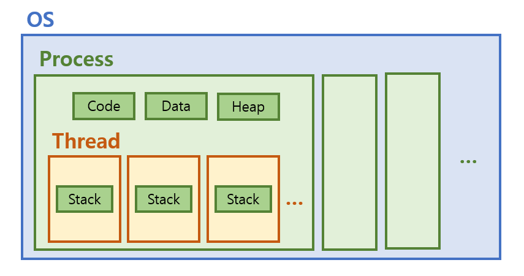

# 프로세스와 스레드

### 차이점
#### 프로세스
- 메모리에 올라와 실행되고 있는 프로그램의 인스턴스
- OS로부터 시스템 자원을 할당받는 작업의 단위

#### 스레드
- 프로세스 내에서 실행되는 여러 흐름의 단위
- 프로세스의 코드에 정의된 절차에 따라 실행되는 특정한 수행 경로

> 프로그램  
> : 어떤 작업을 위해 실행할 수 있는 파일  
> 프로그램이 실행되기 위해서는 OS가 독립적인 메모리 공간을 할당해주어야 한다.  
> 프로그램은 일반적으로 메모리에 올라가지 않은, Windows의 `*.exe`파일 같은 실행 전의 정적인 파일을 의미.

### 메모리 영역


- 스레드는 프로세스 내에서 Stack만 할당받음
- 같은 프로세스에 존재하는 여러 스레드들은 `Code`, `Data`, `Heap` 영역 공유
- 프로세스는 다른 프로세스 메모리에 직접 접근 불가
- 프로세스 실행 중 오류 발생 시 다른 프로세스에 영향 X  
  스레드 실행 중 오류 발생 시 메모리 영역을 공유하므로 같은 프로세스 내 다른 스레드가 강제 종료

> 각 데이터 영역의 저장 정보  
> `코드`: 현재 프로세스에서 실행 중인 프로그램의 바이너리 코드  
> `데이터`: 전역 변수, 상수 등  
> `힙`: 런타임에 할당할 메모리 영역  
> `스택`: 지역 함수, 변수처럼 현재 실행 중인 컨텍스트와 관련된 정보

> 프로세스의 정보에는 접근이 불가능하다?  
> 👉 사실 아예 불가능하지는 않지만 CPU 레지스터 교체나 RAM과 CPU 사이의 캐시 메모리까지 초기화되기 때문에 **자원적 부담**이 큼  
> (1) IPC; Inter-Process Communication 사용  
> (2) LPC; Local inter-Process Communication 사용  
> (3) 별도로 공유 메모리를 생성해 정보 주고받도록 설정  

***

### 멀티 프로세스와 멀티 스레드
#### 멀티 프로세스
- 하나의 응용 프로그램을 여러 프로세스로 구성해 각 프로세스가 하나의 작업을 처리하도록 하는 것
- 여러 자식 프로세스 중 하나가 **문제 발생 시** 해당 프로세스만 죽음. **영향 X**
- **Context-Switching**에서의 **오버헤드**
  - 캐시 메모리 초기화 등 무거운 작업이 진행되고 많은 시간이 소모
  - 프로세스 사이에 공유된 메모리가 없어 `Context Switching` 발생 시 캐시의 모든 데이터를 리셋하고 정보를 불러와야 함
- 프로세스 사이의 어렵고 복잡한 통신 기법 (IPC)

#### 멀티 스레드
- Context-Switching 시 공유하는 메모리 만큼 **메모리 자원을 아낄 수 있음**
- 스레드는 `Stack 영역`을 제외한 모든 메모리를 공유해 통신의 부담이 적음 -> **응답 시간 ↓**
- 한 스레드가 프로세스 내 자원 망치면 모든 프로세스가 종료되어야 함
- 자원 공유로 인한 **동기화 문제**
- 각 스레드는 자신만의 실행 상태를 가질 수 있어 서로 다른 CPU에서도 동작 가능  
  -> 여러 CPU를 단일 회로로 통합한 멀티 코어 프로세서를 이용하면 물리적인 병렬 처리 가능

### Context-Switching  
- 현재 진행중인 프로세스, 스레드 등의 상태를 저장하고 다음 진행할 task의 상태 값을 읽어 적용하는 과정
- 인터럽트 기반으로 동작.  
  인터럽트 발생 시 CPU가 진행 중인 작업 중단  
  -> 해야할 일이 정의된 인터럽트 서비스 루틴 수행

1. 현재 실행 중인 Task의 PCB 정보 저장
2. 다음 실행할 Task의 PCB 정보 읽어 Register에 적재

### 멀티 스레드의 동기화 문제
- 둘 이상의 스레드가 동일한 자원에 접근해 작업한 경우 문제 발생

#### 동기화란?
- 임계 구역에서 스레드들이 순서를 갖춰 자원을 사용하게 하는 것  
  (`임계 구역`: 멀티 스레드에 의해 공유 자원이 서로 참조될 수 있는 코드의 범위)
- 한 스레드가 작업 중 다른 스레드에 의한 간섭을 받지 못하도록 막는 것
- **하나의 자원을 한 번에 하나의 스레드에서만 사용**하도록 하는 기술

#### 임계 구역 문제 해결 조건
- Mutual Exclusion; 상호 배제
  - 임계 구역에 하나의 스레드만 들어감
- Progress; 진행
  - 아무도 임계 구역에 없을 때, 임계 구역에 들어가고자 하는 프로세스가 생기면 들어가게 해줘야 함
- Bounded Wating; 유한 대기
  - 프로세스가 임계 구역에 들어가려고 요청한 후부터 요청이 허용될 때까지 다른 프로세스들이 임계 영역에 들어가는 횟수에 한계가 있어야 함

#### 임계 구역 문제 해결하기
> Race Condition: 하나의 자원을 여러 프로세스나 스레드가 접근할 때 발생할 수 있는 문제
- 명령어 하나만으로 데이터를 읽고 쓰는 작업을 atomic하게 수행하기  
  (임계 구역 문제의 근본 원인은 데이터를 읽고 쓰는 동작을 하나의 명령어로 수행할 수 없기 때문)
- Mutex
  - 하나의 프로세스가 공유 자원을 사용 중이면 다른 프로세스의 접근 막음
- Semaphore
  - 자원의 상태를 나타내는 카운터
  - 임계 구역에 지정 개수만큼 접근 가능
  - 프로세스가 자원을 사용 중이면 세마포어 값을 변경해 다른 프로세스가 접근 시 대기 상태
- Monitor
  - 두 개의 Queue 사용
  - `배타 동기 Queue`: 하나의 스레드만 공유자원에 접근할 수 있도록 하는 공간
  - `조건 동기 Queue`: 진입 스레드가 block되며 새 스레드가 접근할 수 있도록 하는 공간
  - 공유 자원에는 하나의 스레드만 접근 가능하고 나머지는 `배타 동기 Q`에서 대기
  - `진입 스레드`가 조건 동기로 block되면 공유 자원에 `새 스레드` 접근 가능
  - `새 스레드`는 `조건 동기로 block된 스레드`를 `notify()`를 통해 깨울 수 있음
  - `깨워진 스레드`는 `현재 스레드`가 나가면 공유 자원에 다시 접근할 수 있음

- 임계 구역의 길이가 매우 짧다면 -> Block/Wake-up(모니터) 오버헤드보다 Busy/wait(뮤텍스, 세마포어) 오버헤드가 더 커질 수 있음
- 일반적으로는 Block/Wake-up 방식이 더 좋음

#### java에서 동기화 하기
- `synchronized` 키워드 사용
  - 성능 하락
- `inner static class` 이용
  - 내부에 `static class`를 생성해 내부에서 객체를 생성하도록 함
  - `static`은 메모리에 한 번 할당되며 프로그램 종료 시 해제됨
  - 일반적으로 `getInstance()`라는 이름의 메소드를 생성해 `static class`에서 생성한 객체를 반환하도록 함
  - JVM에게 클래스 로딩을 맡기며 static한 싱글톤 인스턴스를 생성해 동기화 환경 구성됨
  - 다만 `Reflection`으로 파훼가 가능
- `Enum` 사용

inner static class 예제
```java
public class Singleton {
    private Singleton() {
    }

    private static class LazyHolder {
        private static final Singleton INSTANCE = new Singleton();
    }

    public static Singleton getInstance() {
        return LazyHolder.INSTANCE;
    }
}
```

### PCB (=Process Control Block)
- 멀티 태스킹에서 커널이 각 프로세스의 정보를 저장하고 관리하기 위해 사용  
  (스레드의 정보를 저장하는건 Thread Control Block으로 PCB에 저장됨)
- PCB의 레지스터에 프로그램 카운터 저장  
  (프로그램 카운터: Context Switching이 일어날 때 현재까지 실행된 코드와 다음으로 실행할 코드 주소)
- 프로세스 상태를 5개로 관리
  - `new`: 프로세스를 위한 PCB가 생성되었지만 메모리에는 올라가있지 않은 상태
  - `ready`: 프로세스가 CPU를 점유하고 사용이 가능한(dispatch) 상태
  - `running`: 프로세스가 현재 CPU를 점유해 작업을 처리 중인 상태
  - `waiting`: `running` 상태인 프로세스가 입출력을 요청한 후 입출력 완료때까지 기다리는 상태
  - `terminated`: 프로세스가 작업을 완료해 메모리 자원을 반납하고 PCB가 삭제된 상태

***

### 사용자 수준 스레드와 커널 수준 스레드 TODO
사용자 레벨 스레드
- 커널 영역의 상위에서 지원
- 일반적으로 사용자 레벨의 라이브러리를 통해 구현
- 라이브러리는 스레드의 생성 및 스케줄링 등에 관한 관리 기능을 제공
- 동일한 메모리 영역에서 스레드가 생성 및 관리되므로 속도가 빠른 장점
- 여러 개의 사용자 스레드 중 하나의 스레드가 시스템 호출 등으로 중단되면 나머지 모든 스레드 역시 중단
- 커널이 프로세스 내부의 스레드를 인식하지 못하며 해당 프로세스를 대기 상태로 전환시키기 때문

커널 레벨 스레드
- 커널 내부에 있는 스레드
- 가장 가벼운 커널 스케쥴링 단위
- 하나의 프로세스는 적어도 하나의 커널 스레드를 가짐
- 커널 영역에서 스레드 연산 수행
- 커널에 종속적
- 스케줄링하는 주체가 커널이면 커널 레벨 스레드라고 함

- Pure user-level
  - 커널 스레드 : 사용자 스레드 = 1 : n
  - 커널은 사용자 스레드가 몇 개가 있든 전혀 모름
  - 사용자 스레드에서 I/O가 하나라도 발생하면 해당 프로세스는 I/O가 풀릴 때 까지 계속 block
- Pure kernel-level
  - 커널 스레드 : 사용자 스레드 = 1 : 1
  - 병렬성 ↑
  - 효율성 ↓
- Combined
  - 커널 스레드와 사용자 스레드 혼합해 사용

***
참고
1. [velog - @raejoonee](https://velog.io/@raejoonee/%ED%94%84%EB%A1%9C%EC%84%B8%EC%8A%A4%EC%99%80-%EC%8A%A4%EB%A0%88%EB%93%9C%EC%9D%98-%EC%B0%A8%EC%9D%B4)
2. [github - nesoy](https://nesoy.github.io/articles/2018-11/Context-Switching)
3. [레스토랑에 비유해서 알아보는 운영체제](https://wormwlrm.github.io/2021/10/04/OS-Restaurant.html)
4. [KOCW 무료 강의 - 반효경 교수님의 운영체제](http://www.kocw.or.kr/home/cview.do?mty=p&kemId=1226304&ar=relateCourse)
5. [github - splin / 뮤텍스, 세마포어, 모니터](https://dev-splin.github.io/cs(computer%20science)/operating%20system/OS-Mutex,Semaphore,Monitor/)
