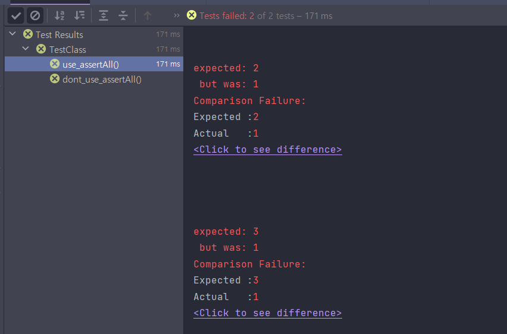
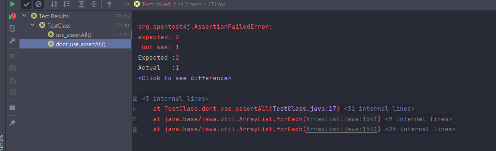

# assertAll을 왜 적용해야할까?

### assertAll 사용

- 모든 에러 로그 출력

```java
@Test
void use_assertAll() {
    assertAll(
            () -> assertThat(1).isEqualTo(2),
            () -> assertThat(1).isEqualTo(3)
    );
}
```



### assertAll 미사용

- 첫 에러 로그만 출력

```java
@Test
void dont_use_assertAll() {
    assertThat(1).isEqualTo(2);
    assertThat(1).isEqualTo(3);
}
```

