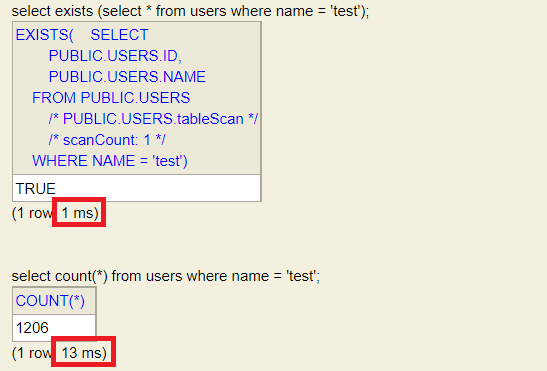

데이터가 존재하는지 검증하기 위해 count(*)를 사용했다.  
리뷰어가 [jojoldu님 블로그](https://jojoldu.tistory.com/516) 를 주시며 exists를 제안해주셨다.  
진짜 exists가 더 빠를지 테스트를 한번 해보았다.


테스트용으로 약 1000개의 데이터를 생성했다.


exists가 count(*)보다 훨씬 더 빠른 것을 확인할 수 있다.  
데이터가 많지 않아 여러번 호출하는 경우 차이가 미미했지만 데이터가 많아질수록 이 차이가 커질 것이라 생각한다.



count 활용 쿼리

```roomsql
SELECT COUNT(*)
FROM USER
WHERE NAME = 'test';
```

exists 활용 쿼리

```roomsql
EXISTS ( 
    SELECT *
    FROM USER
    WHERE NAME = 'test'
)
```