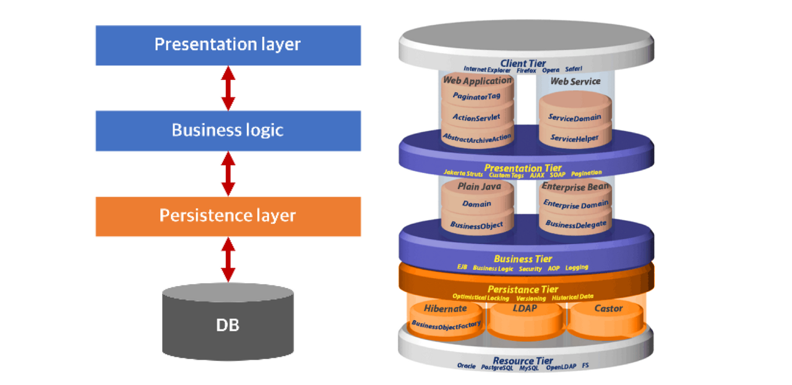

## 계층
> MVC 패턴에 대해 알기 위해서는 계층에 대해 알고 있으면 좋다.  

이전에 계층에 대해 잠깐 알아본 적이 있다.  
  

- Presentation Layer (=UI Layer)
  - 서비스와 관련된 정보 표시
  - 사용자가 직접 액세스할 수 있는 계층 (ex: 웹페이지, OS - GUI, ...)

- Application Layer (=Service Layer)
  - 특정 application 작업을 수행하는데 필요한 작업을 정의
  - 필요한 도메인 작업 위임하고 다른 서비스와 상호 작용

- Business Logic Layer (=Domain Layer)
  - 유효성 검사, 계산같은 로직 포함

- Data Access Layer (=Persistence Layer)
  - 데이터에 영속성을 부여해주는 계층
    (영속성이란? 데이터를 생성한 프로그램이 종료되어도 데이터는 유지되는 특성)

### layer를 나누는 이유
- 추상화를 위함.
- 컴포넌트들의 의존 계층 관계를 깔끔하게 유지

## MVC 패턴
> 위와 같은 layer를 잘 분리하기 위한 디자인 패턴의 일종  
> Model, View, Controller의 약자  

### Model
- 애플리케이션의 동적 데이터 구조. 
- 직접적으로 데이터, 로직, 규칙을 관리.
- 데이터와 비즈니스 로직 분리
- 앱이 표현해야할 데이터가 무엇인지 정의

### View
- 차트, 다이어그램, 테이블 같은 정보 표현 
- 레이아웃과 화면 처리
- 앱의 데이터를 보여주는 방식 정의

### Controller
- 입력을 수락하고 model이나 view에 대한 명령으로 변환.
- 사용자 입력에 대한 응답. (model, view를 업데이트하는 로직 포함)

***
참고
1. [en.wikipedia](https://en.wikipedia.org/wiki/Model%E2%80%93view%E2%80%93controller)
2. [mozilla](https://developer.mozilla.org/ko/docs/Glossary/MVC)