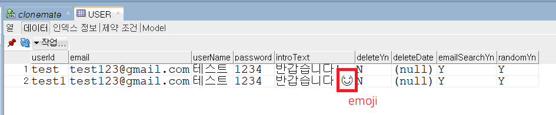

# Data truncation: Incorrect string value: '\xED\x85\x8C\xEC\x8A\xA4...' for column ~~ at row 1 에러

오류 위치를 살펴보니 INSERT 구문을 실행하던 중 한글을 입력하려고 하니 발생하는 오류였다.  
RDS 생성할 때 가장 먼저 체크했던게 UTF8이라 DB 설정 문제는 아니라고 생각했고 (물론 이런 과신은 좋지 않으니 한번 체크하는게 좋긴 하다...😅)  
다른 DB에서 사용 시에는 해당 오류가 발생하지 않아 sqlDeveloper의 문제도 아니라고 생각했다.  

알고보니 테이블 생성 시 UTF 8 설정이 되어있지 않았다.

```
ALTER TABLE 테이블 convert to charset UTF8;
```

테이블 생성할 때 바로 설정할 수도 있다.

```
CREATE TABLE 테이블 (
...
) DEFAULT CHARACTER SET UTF8;
```

추가로 utf8이 아닌 utf8mb4을 이용하면 DB에 이모지를 저장할 수 있다. 😊👍

