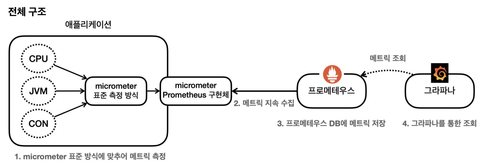

# 마이크로미터
- 애플리케이션의 메트릭(측정 지표)를 마이크로미터가 정한 표준 방법으로 모아서 제공
- 모니터링툴이 변경되면 애플리케이션 코드가 변경된다 -> 모니터링 툴이 변경되어도 마이크로미터 인터페이스에 맞춰 개발된 구현체만 갈아끼우면 된다 식으로 발전한 것
- 스프링 부트 액츄에이터는 마이크로미터를 기본으로 내장해서 사용
  - @AutoConfiguration을 통해 마이크로미터가 제공하는 다양한 메트릭을 적용
- 마이크로미터가 지원하는 모니터링 툴
  - Atlas
  - CloudWatch
  - Datadog
  - Elastic
  - Graphite
  - Influx
  - JMX
  - Prometheus
  - 등등등

# 프로메테우스 & 그라파나
- 프로메테우스: 메트릭을 보관하는 DB
- 그라파나: DB에 있는 데이터를 가져와 사용자가 보기 편하게 보여주는 대시보드

1. 스프링 부트 액츄에이터 & 마이크로미터에서 메트릭 자동으로 생성
2. 프로메테우스는 메트릭 지속적으로 수집 및 저장
3. 사용자가 그라파나를 이용해 그래프로 편하게 메트릭 조회 (필요한 데이터를 프로메테우스를 통해 조회)
