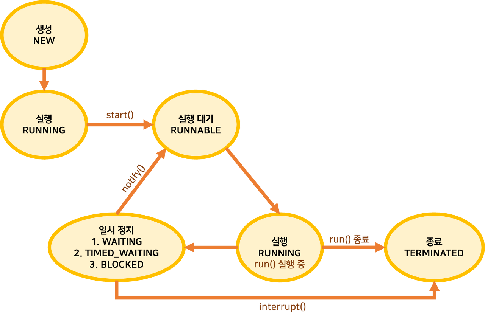

# Thread

- 스레드를 생성하는 또다른 방법
- Thread 클래스를 살펴보면 Runnable을 구현함

```java
public class Thread implements Runnable { ...
}
```

### 스레드 상태



다른 상태들과는 달리 일시 정지에는 여러 종류가 존재한다.

- WAITING: 다른 스레드가 통지할 때까지 기다리는 상태
- TIMED_WAITING: 주어진 시간 동안 기다리는 상태
- BLOCKED: 사용하려는 객체의 락이 풀릴 때까지 기다리는 상태

