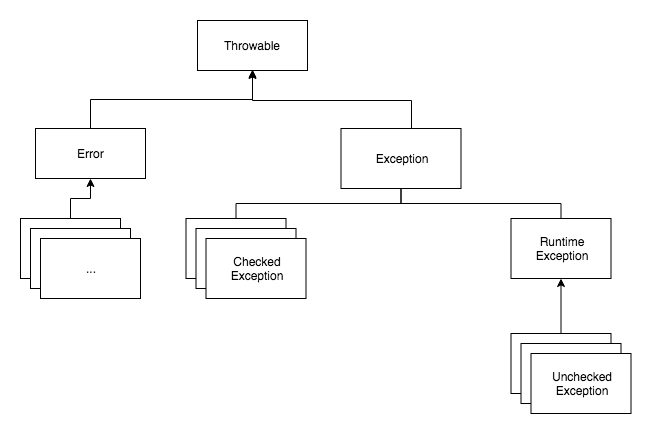

Java에서 오류는 크게 `Error`와 `Exception`으로 나뉜다.  
Exception은 `Checked Exception`과 `Unchecked Exception`으로 나뉜다.

|-|Checked Exception|Unchecked Exception|
|---|---|---|
|Runtime 상속|X|O|
|예외 처리|필수|선택|
|확인 시점|컴파일|런타임|
|예제|IOException, SQLException, ...|IllegalStateException, NullPointerException, ...|

> (+)  
> 간혹 트랜잭션에 대해 Checked는 자동으로 커밋되고 Unchecked는 어떻고 등이 정의된 곳이 많은데 정확하지 않은 정보이다.    
> Exception에 대한 예외 처리는 전적으로 개발자가 정한다.

***
더 자세한 이야기 읽어보기  
👉 https://yeonyeon.tistory.com/215