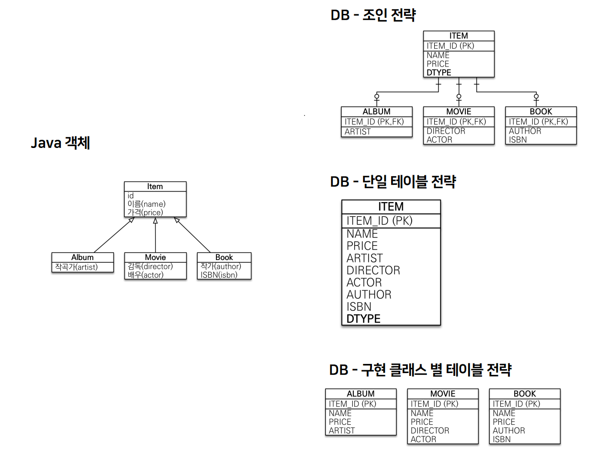

> inflearn / 김영한 / 자바 ORM 표준 JPA 프로그래밍 - 기본편  
> '엔티티 매핑'편

### @Entity
- JPA를 사용해 테이블과 매핑할 클래스
- 파라미터가 없는 기본 생성자 필수 (public, protected)
- `final`, `enum`, `interface`, `inner` 클래스 불가

### @Table
- `name`: 매핑할 테이블 이름 지정
- `catalog`: DB catalog 매핑
- `schema`: DB schema 매핑
- `uniqueConstraints`: DDL 생성 시 유니크 제약 조건 생성

> DDL이란?  
> CREATE, DROP, ALTER, TRUNCATE 같은 데이터 정의어

## JPA의 기능
### DB 스키마 자동 생성
- DDL을 애플리케이션 실행 시점에 자동으로 생성해줌
- 운영이 아닌 개발 환경에서만 사용하도록 유의  
  (운영에서 애플리케이션 실행 중에 테이블의 구조를 변경하는 것은 위험하다.)
- DDL 생성 기능은 DDL을 자동 생성할 때만 사용되고 JPA의 실행 로직에 영향이 가지 않음.

hibernate.hbm2ddl.auto 속성
- `create`: 기존 테이블 삭제 후 생성
- `create-drop`: create와 같으나 종료 시점에 테이블 삭제
- `update`: 변경 사항만 반영
- `validate`: Entity와 Table 정상 매핑 여부만 확인
- `none`: 사용 X

### 필드와 컬럼 매핑
- `@Column`: 컬럼 매핑
- `@Temporal`: 날짜 타입 매핑 (LocalDate 사용 경우 생략 가능)
- `@Enumerated`: enum 타입 매핑
- `@Lob`: BLOB, CLOB 매핑
- `@Transient`: 매핑 무시

### 기본 키 매핑
- 직접 할당: `@Id`만 사용
- 자동 생성: `@GeneratedValue`와 사용

`@GeneratedValue`의 속성
- `IDENTITY`: DB에 위임 (MySQL, PostgreSQL, SQL Server, DB2, ...)
- `SEQUENCE`: DB 시퀀스 오브젝트 사용 (Oracle, PostgreSQL, DB2, H2, ...)
- `TABLE`: 키 생성용 테이블 생성해 DB 시퀀스 흉내
- `AUTO`: 방언에 따라 자동 지정 (default)

> 추가 TIP!  
> 기본 키는 null이 아니고, 유일하고, 변하면 안된다.  
> 예를 들어 주민 등록 번호를 PK로 설정했다고 가정하자.  
> 국가 정책으로 인해 주민 번호를 DB에 저장하지 못하는 상황이 발생한다면?  
> 사용자 테이블은 PK를 변경하기만 하면 되지만 해당 테이블을 조인시킨 테이블들에는 문제가 발생한다.  
> 권장: Long + 대체키 + 키 생성 전략 사용

### 상속 관계 매핑
관계형 DB는 상속 관계를 갖지 않는다 (슈퍼타입, 서브타입이 유사한 기능)

슈퍼타입 서브타입 논리 모델을 실제 물리 모델로 구현하는 방법

1. 각각 테이블로 변환 -> 조인 전략
2. 통합 테이블로 변환 -> 단일 테이블 전략
3. 서브타입 테이블로 변환 -> 구현 클래스별 테이블 전략

#### 조인 전략
- 테이블의 정규화
- 외래 키 참조 무결성 제약조건 활용 가능
- 저장공간 효율화
- 비즈니스 로직적으로 중요하면 join하여 사용
- 조회 시 조인 많이 사용 (성능 저하 가능성)
- 조회 쿼리의 복잡성
- 데이터 저장 시 INSERT문 2번 호출  
  (ex: ALBUM에 컬럼 추가하려면 ALBUM과 ITEM 테이블에 INSERT 해야함)

#### 단일 테이블 전략
- 조인이 필요 없으므로 일반적으로 조회 성능 빠름
- 조회 쿼리 단순
- 자식 엔티티가 매핑한 컬럼이 존재하지 않으면 null 허용
- 단일 테이블에 모든 것을 저장해 테이블이 커짐 (상황에 따라 조회 성능 오히려 떨어질수도)  
  (다만 이 경우는 테이블이 임계점에 다를 때 발생하는 문제로 보통은 문제가 없어서 많이 사용)

#### 구현 클래스별 테이블 전략
- DBA, ORM 모두가 비추천
- 서브 타입을 명확하게 구분해 처리할 때 효과적
- not null 제약조건 사용 가능
- 여러 자식 테이블을 함께 조회할 때 UNION 필요 (성능 저하)
- 자식 테이블을 통합해 쿼리하기 어려움

> **@MappedSuperclass**  
> 공통 매핑 정보가 필요할 때 사용  
> (ex: createdDate, updatedDate, ... )  
> 직접 생성해 사용할 일이 없으므로 abstract class으로 선언 추천  
> 참고로 @Entity 클래스는 @Entity 또는 @MappedSuperclass로 지정한 클래스만 상속 가능.