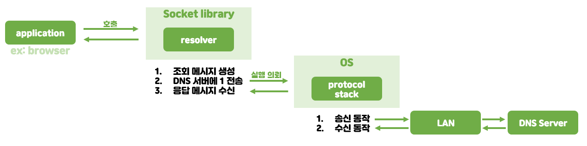

### 도메인명 vs IP 주소

- TCP/IP에 전달할 주소는 왜 `도메인`일까?
    - `IP 주소`를 전달해도 정상 동작
    - 하지만 사용자가 `IP 주소`를 기억하는건 어려움
- TCP/IP가 `도메인명`으로 통신을 가능하게 한다면?
    - 라우터에 부하가 오고 실행 효율이 떨어짐
        - `IP 주소`: 32 bit = 4 byte
        - `도메인명`: n ~ 255 byte
    - 고성능 라우터를 사용한다면 부하가 안 올 것 같은데?
        - 라우터의 속도는 한계가 있음
        - 라우터의 속도가 발전해도 사용자가 보내는 데이터의 양도 함께 증가하고 있음

👉 이를 해결해주기 위해 나온 것이 DNS

### DNS; Domain Name System

- 도메인명을 IP 주소로 변환해줌

#### DNS 서버 조회 과정

> DNS 리졸버는 DNS 서버에 조회 메시지를 전송하고 응답 메시지를 수신하는 역할을 한다.  
> 리졸버는 OS의 네트워크 기능을 호출할 수 있게 해주는 소켓 라이브러리에 존재한다.  
> `name resolution`을 호출해 IP 주소를 조사한다.

1. 애플리케이션(ex: 브라우저)에서 리졸버 호출
    - ex: <메모리 영역> = getHostByName("www.yeonyeon.tistory.com");  
      저장할 메모리의 위치 = 리졸버 프로그램명(도메인명);
2. 리졸버가 DNS 서버에 조회 메시지를 전송
    - DNS 서버에 보내는 조회 메시지 생성
    - DNS 서버에 전송 (OS 내부의 프로토콜 스택에 실행 의뢰)
        - 리졸버 자체에 DNS 서버에 송신하는 기능 X
        - 프로토콜 스택: OS에 내장된 네트워크 제어용 소프트웨어로 여기서는 DNS 서버로 송수신 동작을 맡음
    - DNS 서버에서 응답 메시지 수신
3. 리졸버가 DNS 서버에서 응답 메시지를 수신
4. 3에서 필요한 데이터를 추출해 메모리 영역에 저장
5. 이후 브라우저에서 웹 서버로 요청 보낼 때 4의 영역에서 IP를 추출해 HTTP 요청 메시지와 함께 OS에 송신 의뢰