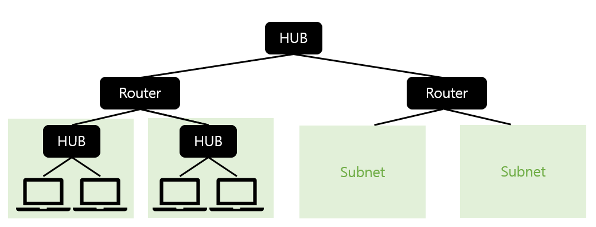

## TCP/IP

- 서브넷을 라우터로 접속하는 형태로 전체 네트워크 구성
- 서브넷
  - : 작은 네트워크. 허브와 PC 여러 대로 이루어짐.
  - PC가 적으면 허브 1대로 충분
  - PC가 많아지면 허브들을 연결해 허브의 수를 늘림
  - 허브들을 연결한 것도 서브넷으로 취급
- 서브넷에 IP 주소를 할당해 해당 주소에 따라 액세스 대상의 위치 판별
  - IP 주소
    - 네트워크 번호 + 호스트 번호

1. 송신 측에서 가장 가까운 라우터까지 운반
  - 운반은 허브가 해준다
2. 라우터가 메시지 보낸 상대 확인 + 다음 라우터 판단
3. 다음 라우터로 운반하여 2 반복
4. 2~3 반복하다 최종적으로 상대의 데이터 도착

# TCP/IP 4계층

### 응용 계층

- 응용 프로그램 간의 데이터 송수신
- HTTP, SSH, SMTP, ..

### 전송 계층

- 호스트 간의 자료 송수신
- TCP, UDP, ..

### 인터넷 계층

- 데이터 전송을 위한 논리적 주소/경로 지정
- IP, ARP, ...

### 네트워크 액세스 계층

- 실제 프레임 송수신
- Ethernet, Token Ring, ...
