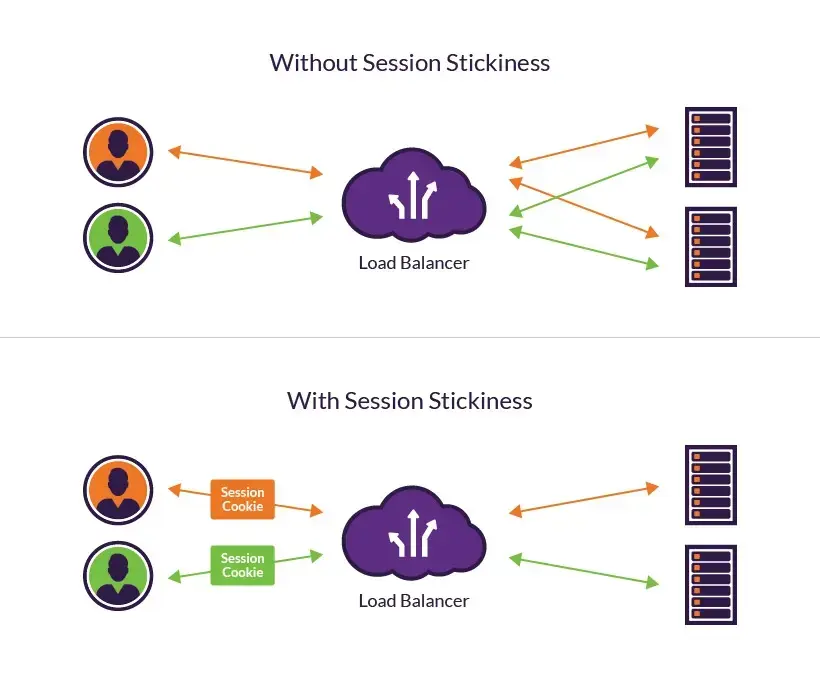
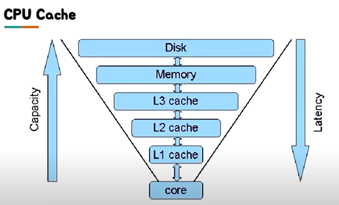
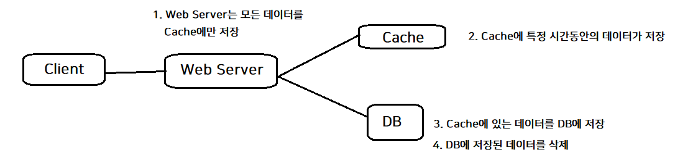
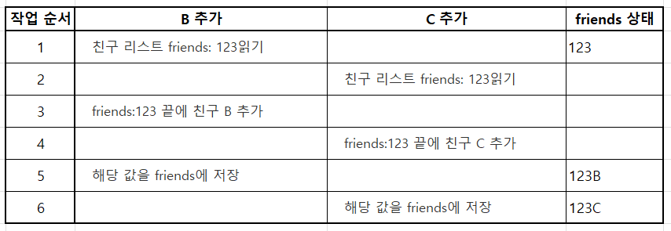

> 세션을 어떻게 관리하는지에 대한 고민을 하다가 Redis에 대해 알게 되었다.  
> Redis를 사용하는 이유가 뭘까?에 대한 궁금증을 해결하기 위해 포스팅하게 되었다.

***

# 목차
1. 세션이란?
2. Redis란?
3. Redis를 사용하는 곳
4. Redis를 왜 사용하는가?

***

### 🤔 세션이란?
- 서버에 저장되는 쿠키
- 클라이언트와 서버의 통신 상태
- 서비스가 직접 관리 해야하는 중요한 정보 관리
- 여러 요청들을 포함해 하나의 트랜잭션이나 작업을 완료하는데 걸리는 시간

#### Sticky Session
- sticky? 끈적끈적한, 잘 떨어지지 않는.
- Session Stickiness = Session Persistence
- 로드 밸랜서가 세션 기간 동안(IP가 웹 사이트에서 보내는 시간) 클라이언트와 특정 네트워크 서버 간의 관계를 생성하는 작업
- 로드 밸랜서는 쿠키나 IP의 상세 정보를 트래킹해 사용자에게 고유 속성을 부여  
  -> 트래킹 ID에 따라 세션 기간 동안 한 사용자의 모든 요청을 특정 서버로 라우팅

### 😲 Redis란?
In-Memory Data Structure Store
지원하는 자료구조
- Strings, set, 정렬된 set, hashes, list
- Hyperloglog, bitmap, geospatial index
- Stream

 

#### 🔻 Cache에 대해 잠깐 알아보기
Cache
: 결과를 미리 저장해두었다가 나중에 요청이 들어오면 빠르게 서비스 해주는 것

**예제 - Factorial**
n!은 1 ... n까지를 곱한 수를 의미한다.  
만약 100000!과 100001!를 구해야한다고 가정해보자  
100000!를 구한 뒤 이 결과를 다른 곳에 저장해두었다면?  
100001!을 계산할 때 이용하여 빠르게 계산이 가능하다.

**CPU Cache**

위 그림을 보면 용량은 위로 갈수록 커지고 속도는 아래로 갈수록 빨라진다.  
디스크에 접근하는 속도가 느리니 데이터를 메모리에 두고 접근하면 더 빠르게 접근할 수 있을 것이다.

### 🚀 Redis를 사용하는 곳
- Remote Data Store: 여러 서버에서 데이터를 공유하고 싶을 때
- 단 한 대의 서버가 있더라도 Redis가 Atomic을 보장해 편리함  
  (아래 Redis를 왜 사용하는가? 참조)
- Memory Cache를 이용하게 되면 훨씬 더 빠른 속도로 서비스가 가능

#### 주로 사용하는 예제
- 인증 토큰 저장
- Ranking 보드로 사용
- 유저 API Limit
- Job Queue

#### Redis 사용 유형
**1. Look aside Cache**  

- 일반적으로 많이 사용하는 패턴

**2. Write Back**  

- write 작업이 정말 많은 경우 사용  
  (쿼리문 1개를 100번 날리는 것보다 쿼리문 100개를 1번에 날리는 경우가 더 빠른다)
- 단, DB에 저장되기 전에 장애가 생기면 데이터가 사라질 가능성이 있음

### 🪂 Redis를 왜 사용하는가?
Collection을 잘 이용함으로써 여러 개발 시간을 단축시키고 문제를 줄여줄 수 있기 때문이다.  
아래 두 가지 예제를 살펴보자.

 

#### 1. 랭킹 서버 구현
가장 심플한 방법으로는 DB에 유저 score를 저장하고 order by로 정렬해 읽어오기가 있다.  
-> 속도에 문제

In-Memory 기준으로 랭킹 서버의 구현이 필요하다.  
직접 구현하기는 힘들지만 Redis의 Sorted Set을 이용하면 랭킹을 손쉽게 구현할 수 있다.

#### 2. 친구 리스트
친구 리스트를 key-value 형태로 저장한다고 가정할 때, A가 B를 친구로 추가하면 아래와 같은 과정을 거친다.

1. 친구 리스트 friends: 123읽기
2. friends:123 끝에 친구 B 추가
3. 해당 값을 friends:123에 저장

만약 친구 B, C를 동시에 추가한다고 하면?  

B가 추가되기 전에 C가 friends를 읽고 값을 수정했기 때문에 B를 추가한 내역이 사라졌다.

이를 Redis로 구현한다면?  
Redis는 자료구조가 Atomic 하기 때문에 위와 같은 Race Condition 상황을 피할 수 있다.  
다만 구조를 잘못 설계하면 발생할 수는 있다. (ex: 클릭을 빠르게 두번 눌러서 요청이 여러번 전송)

***
### 참고

- https://www.imperva.com/learn/availability/sticky-session-persistence-and-cookies/
- 우아한 테크 세미나 - [우아한 레디스 by 강대명님](https://www.youtube.com/watch?v=mPB2CZiAkKM)