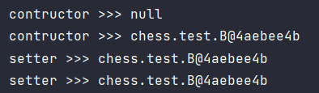
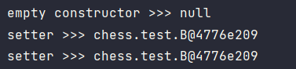
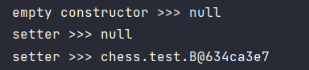

### 의존성 주입 방법을 동시에 여러개 사용한다면?

> 어떤 순서로 주입되는지 궁금해서 찾아보게 되었다.

결론부터 말하자면 `생성자 -> 필드 -> 세터` 순서로 호출된다.

테스트용도로 print를 막 찍어보았다.

### 생성자 + 필드 + 세터 주입
```java
@Component
public class A {
    @Autowired
    private B b;

    public A() {
        System.out.println("empty constructor >>> " + this.b);
    }

    @Autowired
    public A(B b) {
        System.out.println("contructor >>> " + this.b);
        this.b = b;
        System.out.println("contructor >>> " + this.b);
    }

    @Autowired
    public void setB(B b) {
        System.out.println("setter >>> " + this.b);
        this.b = b;
        System.out.println("setter >>> " + this.b);
    }

    public void print() {
        b.print();
    }
}
```


### 필드 + 세터 주입
```java
@Component
public class A {
    @Autowired
    private B b;

    public A() {
        System.out.println("empty constructor >>> " + this.b);
    }
    
    public A(B b) {
        System.out.println("contructor >>> " + this.b);
        this.b = b;
        System.out.println("contructor >>> " + this.b);
    }

    @Autowired
    public void setB(B b) {
        System.out.println("setter >>> " + this.b);
        this.b = b;
        System.out.println("setter >>> " + this.b);
    }

    public void print() {
        b.print();
    }
}
```


### 세터 주입
```java
@Component
public class A {
    private B b;

    public A() {
        System.out.println("empty constructor >>> " + this.b);
    }

    public A(B b) {
        System.out.println("contructor >>> " + this.b);
        this.b = b;
        System.out.println("contructor >>> " + this.b);
    }

    @Autowired
    public void setB(B b) {
        System.out.println("setter >>> " + this.b);
        this.b = b;
        System.out.println("setter >>> " + this.b);
    }

    public void print() {
        b.print();
    }
}
```


이 순서에 관련해서는 [StackOverflow](https://stackoverflow.com/questions/63826101/spring-dependency-injection-which-takes-precedence) 에 설명이 잘 되어있다.

1의 경우는 객체에서 어떤 동작을 실행하기 위해 일단 객체를 생성해야 하니 당연한 일이다.

2, 3의 순서는 `AutowiredAnnotationBeanPostProcessor` 클래스의 `buildAutowiringMetadata()` 메서드에 선언되어 있다.

```java
// AutowiredAnnotationBeanPostProcessor 클래스 
private InjectionMetadata buildAutowiringMetadata(Class<?> clazz) { 
    // ... 
        
    ReflectionUtils.doWithLocalFields(targetClass, field -> { 
        // ... 
    }); 
    
    ReflectionUtils.doWithLocalMethods(targetClass, method -> { 
        // ... 
    }); 
    
    // ... 
}
```