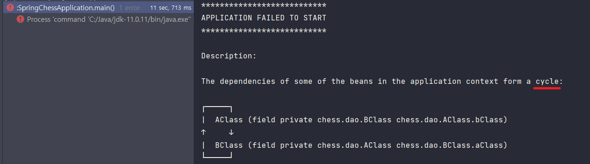

### @Autowired를 통해 서로를 필드 주입하려고 하면 어떤 상황이 발생할까?

예제를 살펴보자.

```java

@Component
public class AClass {

    @Autowired
    private BClass bClass;
}
```

```java

@Component
public class BClass {

    @Autowired
    private AClass aClass;
}
```

기존에는 위 코드를 실행시키려고 하면 서버는 동작했다.  
다만 AClass의 메서드 또는 BClass의 메서드를 호출하려고 하면 순환 참조가 일어나며 서버가 종료됐다.

하지만 Spring Boot 2.6에서 개선되었다.
> **Circular References Prohibited by Default**  
> Circular references between beans are now prohibited by default. If your application fails to start due to a BeanCurrentlyInCreationException you are strongly encouraged to update your configuration to break the dependency cycle. If you are unable to do so, circular references can be allowed again by setting spring.main.allow-circular-references to true, or using the new setter methods on SpringApplication and SpringApplicationBuilder This will restore 2.5’s behaviour and automatically attempt to break the dependency cycle.  
> <br>
> 출처: https://github.com/spring-projects/spring-boot/wiki/Spring-Boot-2.6-Release-Notes#circular-references-prohibited-by-default

이제는 순환 참조가 일어나는 경우 서버가 시작이 되지 않는다.

